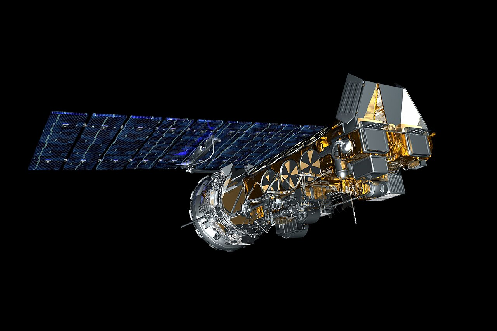

<a href="../project-pdfs/V_Dipole_Antenna.pdf" download="V_Dipole_Antenna.pdf">Download PDF</a>
</head>
<body>
<header id="title-block-header">
<h1 class="title">V-Dipole Antenna</h1>

Mikkel Hulstrøm

August 2026

</header>
<h1 id="introduction">Introduction</h1>
<figure id="fig:noaa18" data-latex-placement="htbp">

<figcaption>Billede af NOAA18 fra https://en.wikipedia.org/wiki/NOAA-18.<figcaption>

</figure>
<h1 id="overview">Overview</h1>

En V-Dipol antenne er lavet ved at man har to længder rør/kabel kald
det hvad du vil som er placeret 120 grader fra hinanden. En Dipol
antenne er lavet ved at de to længder skal være 1/2 bølgelængde
sammenlagt og 1/4 bølgelængde hver især. Det udregner man ved
formlen

<math display="block" xmlns="http://www.w3.org/1998/Math/MathML"><semantics><mrow><mi>λ</mi><mo>=</mo><mfrac><mi>c</mi><mi>f</mi></mfrac></mrow><annotation encoding="application/x-tex">\lambda=\frac{c}{f}</annotation></semantics></math>

Denne antenne kan man bruge til at opfange signaler fra
vejrsatelitter når de er over en på himlen. Man kan bruge online
værktøjer som https://www.n2yo.com. Til at tjekke præcist hvor
satelitter er henne og hvornår. Derudover kan man bruge en SDR til at
modtage de her signaler og processe dem. Et program som SDR++ kan herfra
bruges til at tilgå SDR’en for at optage signalerne for så senere at
kunne decode dem om til billeder.

<h1 id="design">Design</h1>

Så som det første skal vi finde ud af hvad længden på de to antenner
skal være. Som jeg nævnte før skal man bruge
<math display="inline" xmlns="http://www.w3.org/1998/Math/MathML"><semantics><mfrac><mn>1</mn><mn>2</mn></mfrac><annotation encoding="application/x-tex">\frac{1}{2}</annotation></semantics></math>
bølgelængde sammenlagt på de to antenner så man får to antenner på
<math display="inline" xmlns="http://www.w3.org/1998/Math/MathML"><semantics><mfrac><mn>1</mn><mn>4</mn></mfrac><annotation encoding="application/x-tex">\frac{1}{4}</annotation></semantics></math>
bølgelængde. Så lad os først starte med at regne bølgelængden ud af den
frekvens vi godt vil have antennen til at være resonant ved. Vi ved at
frekvensen på de kendte NOAA satelitter og Meteor satelitterne er begge
ca
<math display="inline" xmlns="http://www.w3.org/1998/Math/MathML"><semantics><mrow><mn>137</mn><mo>,</mo><mn>9</mn></mrow><annotation encoding="application/x-tex">137,9</annotation></semantics></math>
MHz.

<math display="block" xmlns="http://www.w3.org/1998/Math/MathML"><semantics><mtable><mtr><mtd columnalign="right" style="text-align: right; padding-right: 0"><mi>λ</mi></mtd><mtd columnalign="left" style="text-align: left; padding-left: 0"><mo>=</mo><mfrac><mi>c</mi><mi>f</mi></mfrac></mtd></mtr><mtr><mtd columnalign="right" style="text-align: right; padding-right: 0"></mtd><mtd columnalign="left" style="text-align: left; padding-left: 0"><mo>=</mo><mfrac><mi>c</mi><mrow><mn>137</mn><mo>,</mo><mn>9</mn><mi>M</mi><mi>H</mi><mi>z</mi></mrow></mfrac></mtd></mtr><mtr><mtd columnalign="right" style="text-align: right; padding-right: 0"></mtd><mtd columnalign="left" style="text-align: left; padding-left: 0"><mo>=</mo><mn>2</mn><mo>,</mo><mn>174</mn><mi>m</mi></mtd></mtr></mtable><annotation encoding="application/x-tex">\begin{aligned}
\lambda&amp;=\frac{c}{f} \\
&amp;=\frac{c}{137,9MHz} \\
&amp;= 2,174m
\end{aligned}</annotation></semantics></math>

Og så finder vi
<math display="inline" xmlns="http://www.w3.org/1998/Math/MathML"><semantics><mfrac><mn>1</mn><mn>4</mn></mfrac><annotation encoding="application/x-tex">\frac{1}{4}</annotation></semantics></math>
af bølgelængden.
<math display="block" xmlns="http://www.w3.org/1998/Math/MathML"><semantics><mrow><mi>λ</mi><mo>*</mo><mfrac><mn>1</mn><mn>4</mn></mfrac><mo>=</mo><mn>0</mn><mo>,</mo><mn>5435</mn><mi>m</mi></mrow><annotation encoding="application/x-tex">\lambda*\frac{1}{4}=0,5435m</annotation></semantics></math>
Det vil så sige at hver antenne skal være omkring 54,3cm.

Men virkeligheden afspejler ikke altid formlerne og derfor er man nød
til at bruge en anden mere realistisk tilgang. Da jeg har tænkt mig at
bruge massivt Ø10mm aluminium stænger, vil radiosignalerne have en
langsommere hastighed i overfladen af metallet. Og man er derfor nød til
at regne K-faktoren(k) ud.
<math display="block" xmlns="http://www.w3.org/1998/Math/MathML"><semantics><mtable><mtr><mtd columnalign="right" style="text-align: right"><mi>R</mi><mo>=</mo><mfrac><mi>λ</mi><mrow><mn>2</mn><mo>*</mo><mi>D</mi></mrow></mfrac><mo>=</mo><mfrac><mrow><mn>2</mn><mo>,</mo><mn>174</mn><mo>*</mo><msup><mn>10</mn><mn>3</mn></msup><mi>m</mi></mrow><mrow><mn>2</mn><mo>*</mo><mn>10</mn><mi>m</mi><mi>m</mi></mrow></mfrac><mo>=</mo><mn>108</mn><mo>,</mo><mn>7</mn></mtd></mtr></mtable><annotation encoding="application/x-tex">\begin{aligned}
R=
\frac{\lambda}{2*D}
=\frac{2,174*10^3m}{2*10mm} 
=108,7
\end{aligned}</annotation></semantics></math>

<math display="block" xmlns="http://www.w3.org/1998/Math/MathML"><semantics><mrow><mi>k</mi><mo>=</mo><mn>0</mn><mo>,</mo><mn>9787</mn><mo>−</mo><mo minsize="300%" maxsize="300%" stretchy="true" form="prefix">[</mo><mfrac><mrow><mn>11</mn><mo>,</mo><mn>865</mn></mrow><mrow><mo stretchy="false" form="prefix">(</mo><mn>1</mn><mo>+</mo><mo stretchy="false" form="prefix">(</mo><mfrac><mi>R</mi><mrow><mn>0</mn><mo>,</mo><mn>000449</mn></mrow></mfrac><msup><mo stretchy="false" form="postfix">)</mo><mrow><mn>1</mn><mo>,</mo><mn>7925</mn></mrow></msup><msup><mo stretchy="false" form="postfix">)</mo><mrow><mn>0</mn><mo>,</mo><mn>3</mn></mrow></msup></mrow></mfrac><mo minsize="300%" maxsize="300%" stretchy="true" form="postfix">]</mo></mrow><annotation encoding="application/x-tex">k=0,9787-\Biggl[\frac{11,865}{(1+(\frac{R}{0,000449})^{1,7925})^{0,3}}\Biggr]</annotation></semantics></math>

Og hvis vi så sætter
<math display="inline" xmlns="http://www.w3.org/1998/Math/MathML"><semantics><mi>R</mi><annotation encoding="application/x-tex">R</annotation></semantics></math>
ind i formlen får vi
<math display="block" xmlns="http://www.w3.org/1998/Math/MathML"><semantics><mrow><mi>k</mi><mo>=</mo><mn>0</mn><mo>,</mo><mn>955</mn></mrow><annotation encoding="application/x-tex">k=0,955</annotation></semantics></math>
Nu kan vi så udregne den længde antenner skal have ved at tage den
teoretiske længde og gange med
<math display="inline" xmlns="http://www.w3.org/1998/Math/MathML"><semantics><mi>k</mi><annotation encoding="application/x-tex">k</annotation></semantics></math>
<math display="block" xmlns="http://www.w3.org/1998/Math/MathML"><semantics><mrow><mn>0</mn><mo>,</mo><mn>5435</mn><mi>m</mi><mo>*</mo><mn>0</mn><mo>,</mo><mn>955</mn><mo>=</mo><mn>0</mn><mo>,</mo><mn>519</mn><mi>m</mi></mrow><annotation encoding="application/x-tex">0,5435m*0,955=0,519m</annotation></semantics></math>
Så har vi regnet os frem til at hver antenne ben skal have længde på
<math display="inline" xmlns="http://www.w3.org/1998/Math/MathML"><semantics><mrow><mn>51</mn><mo>,</mo><mn>9</mn></mrow><annotation encoding="application/x-tex">51,9</annotation></semantics></math>cm.
Og vi behøves ikke tilføje længde til benene der hvor mounten skal sidde
da den skal laves i 3d print materiale som PETG eller ASA hvilket
nærmest er usynligt for radiobølger i den frekvens.

Udregning af båndbredde kan gøres ved

</body>
</html>

